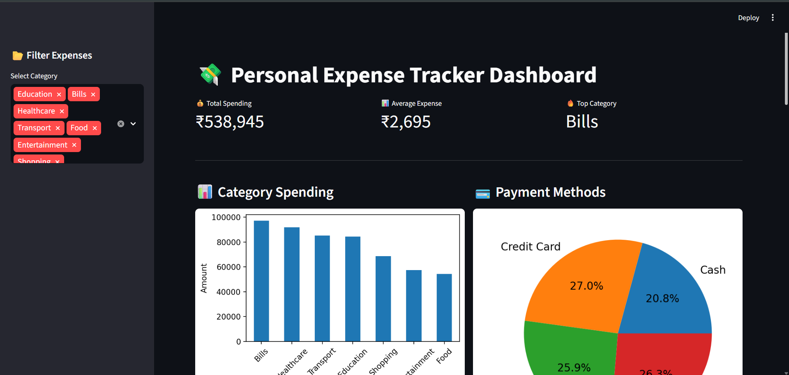
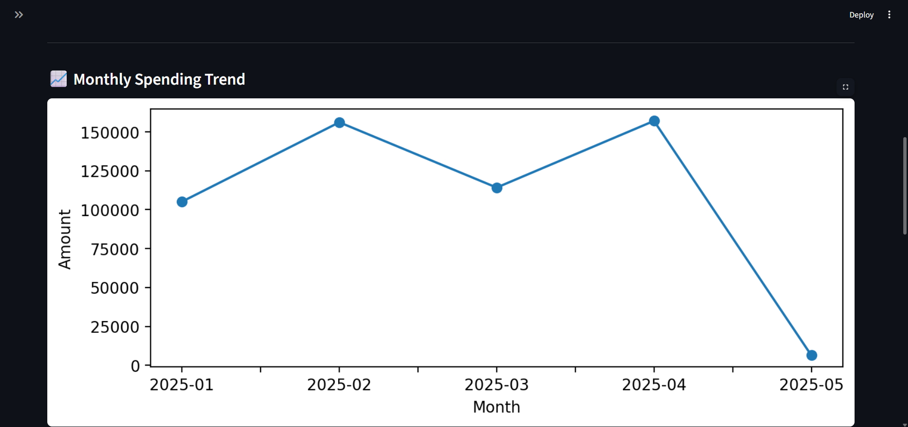
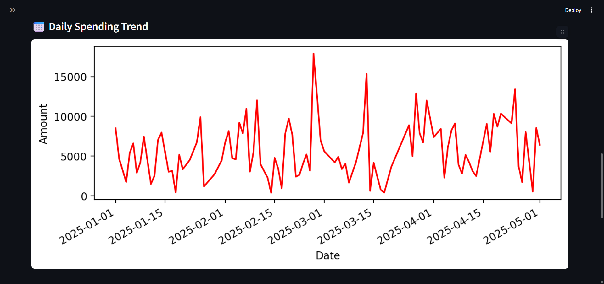

# 💸 Personal Expense Tracker with Data Visualization

## 📌 Project Overview

A Python-based Personal Expense Tracker that helps users:

- Track expenses
- Analyze spending behavior
- Visualize monthly trends
- Generate financial reports
- Monitor payment methods
- Understand spending habits

This project demonstrates real-world applications of:
- Python Programming
- Data Analysis
- Data Visualization
- SQLite Database Integration
- Dashboard Development

---

# 🚨 Problem Statement

Many individuals struggle to:
- Track daily expenses
- Identify overspending
- Manage budgets effectively
- Analyze financial patterns

This project solves these problems using Python analytics and interactive visualizations.

---

# 🎯 Features

✅ Synthetic Expense Dataset Generation  
✅ CSV Data Storage  
✅ SQLite Database Integration  
✅ Data Cleaning using Pandas  
✅ Category-wise Expense Analysis  
✅ Monthly Spending Analysis  
✅ Payment Method Analysis  
✅ Daily Spending Trend Analysis  
✅ Data Visualization using Matplotlib  
✅ Interactive Streamlit Dashboard  
✅ Downloadable Reports  

---

# 🛠️ Tech Stack

- Python
- Pandas
- NumPy
- Matplotlib
- Seaborn
- SQLite
- Streamlit

---

# 📂 Folder Structure

```text
Python- Personal Expense Tracker with Data Visualization
│
├── screenshots
├── data
├── db
├── images
├── outputs
├── reports
├── src
├── venv
├── app.py
├── main.py
├── database_setup.py
├── requirements.txt
├── README.md
└── .gitignore
```

---

# 📊 Dataset Information

The project uses a synthetic expense dataset generated using Python.

## Dataset Columns

| Column Name | Description |
|---|---|
| Date | Expense transaction date |
| Category | Expense category |
| Amount | Transaction amount |
| Payment_Method | Mode of payment |
| Description | Expense description |

---

## Expense Categories Used

- Food
- Transport
- Shopping
- Bills
- Entertainment
- Healthcare
- Education

---

## Payment Methods Used

- UPI
- Cash
- Credit Card
- Debit Card

---

## Dataset Purpose

The dataset is used for:
- Financial analysis
- Spending trend analysis
- Visualization generation
- Database storage practice
- Dashboard development

---

# ⚙️ Installation

## 1️⃣ Clone Repository

```bash
git clone YOUR_GITHUB_LINK
```

---

## 2️⃣ Create Virtual Environment

### Windows

```bash
python -m venv venv
venv\Scripts\activate
```

### Mac/Linux

```bash
python3 -m venv venv
source venv/bin/activate
```

---

## 3️⃣ Install Dependencies

```bash
pip install -r requirements.txt
```

---

# ▶️ How to Run

## Run Main Project

```bash
python main.py
```

---

## Setup Database

```bash
python database_setup.py
```

---

## Launch Streamlit Dashboard

```bash
streamlit run app.py
```

---

# 📊 Dashboard Preview

## 💻 Streamlit Dashboard



---

# 📈 Category-wise Spending & Payment Method Distribution


---

# 📉 Monthly Spending Trend



---

# 📅 Daily Spending Trend



---

# 📊 Generated Outputs

The project generates:

- Expense Dataset CSV
- Cleaned Expense Data
- SQLite Database
- Category-wise Spending Chart
- Monthly Spending Trend Chart
- Payment Method Distribution Chart
- Daily Spending Trend Chart
- Final Expense Report

---

# 🧠 Key Learnings

Through this project I learned:

- Data Cleaning
- Financial Data Analysis
- Data Visualization
- Dashboard Development
- SQLite Database Integration
- Python Automation
- GitHub Project Management

---

# 🚀 Future Improvements

- OCR-based Receipt Scanner
- AI Expense Categorization
- Budget Alerts
- Mobile App Integration
- Cloud Deployment
- Multi-user Authentication

---

# 🌟 Industry Relevance

This project is highly relevant for roles such as:

- Python Developer
- Data Analyst
- Business Analyst
- Financial Analyst
- Automation Engineer

---

# 👩‍💻 Author

Aarthi Kole

Second-Year Electrical & Electronics Engineering Student  
SDMCET Dharwad, Karnataka

Passionate about:
- Python Development
- Data Analytics
- Frontend Development
- Finance Analytics
